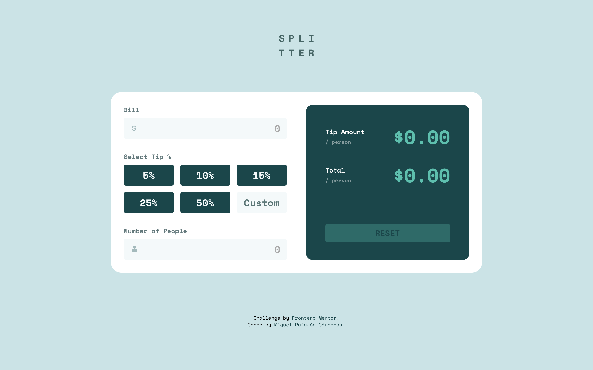

# Frontend Mentor - Tip calculator app solution

This is a solution to the [Tip calculator app challenge on Frontend Mentor](https://www.frontendmentor.io/challenges/tip-calculator-app-ugJNGbJUX).

## Table of contents

- [Overview](#overview)
  - [The challenge](#the-challenge)
  - [Screenshot](#screenshot)
  - [Links](#links)
- [My process](#my-process)
  - [Built with](#built-with)
  - [What I learned](#what-i-learned)
  - [Continued development](#continued-development)
  - [Useful resources](#useful-resources)
- [Author](#author)

## Overview

### The challenge

Users should be able to:

- View the optimal layout for the app depending on their device's screen size
- See hover states for all interactive elements on the page
- Calculate the correct tip and total cost of the bill per person

### Screenshot



### Links

- Solution URL: [GitHub Repository](https://github.com/mpujazon/tip-calculator-app-main)
- Live Site URL: [Live Site on Vercel](https://tip-calculator-app-main-lemon.vercel.app/)

## My process

### Built with

- Semantic HTML5 markup
- CSS custom properties
- Flexbox
- CSS Grid
- Javascript
- Mobile-first workflow

### What I learned

I learned how to hide the spin buttons on number input fields in different browsers:

```css
input[type=number]::-webkit-inner-spin-button, 
input[type=number]::-webkit-outer-spin-button { 
    -webkit-appearance: none; 
    margin: 0; 
}
input[type=number] { 
    -moz-appearance:textfield;
    appearance: textfield;
}
```
### Continued development

In the next projects I want to improve the code cleaning, I also would like to reduce the time needed to finnish the project and I would like to start using a JS library/framework like React, Angular or Vue.

### Useful resources

- [How to delete the spin buttons on number inputs](https://es.stackoverflow.com/questions/20484/cómo-eliminar-los-botones-de-un-input-number) - This helped to hide the spin buttons as I mentioned before.

## Author

- GitHub - [Miguel Pujazón Cárdenas](https://github.com/mpujazon/)
- Frontend Mentor - [@mpujazon](https://www.frontendmentor.io/profile/mpujazon)